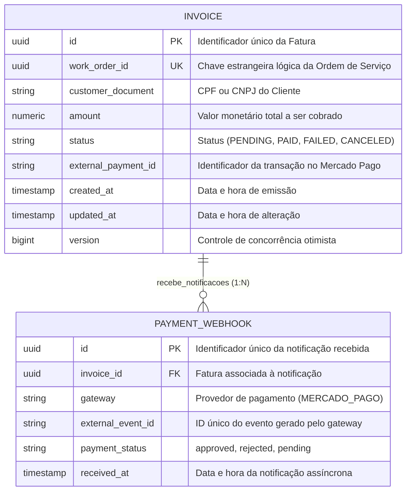

# Microsserviço de Faturamento e Pagamentos (`15soat-phase4-api-billing`)

Microsserviço responsável pela gestão de faturas, orçamentos, integração com gateway de pagamentos (Mercado Pago) e participação na Saga coreografada via Apache Kafka.

## Arquitetura & Tecnologias
- **Java 25 LTS**
- **Spring Boot 4.0.7** & Spring Data JPA
- **Arquitetura Hexagonal (Ports & Adapters)**:
  - `domain`: Regras puras de negócio, sem dependência de frameworks.
  - `application`: Drivers Spring Boot, adaptadores de repositório JPA PostgreSQL, consumidores e produtores de eventos Kafka, controllers REST.
- **Banco de Dados**: PostgreSQL (Relacional) com controle de versão via migrations Flyway.
- **Mensageria de Eventos**: Apache Kafka para coreografia distribuída da Saga.
- **Gateway de Pagamento**: Integração com Mercado Pago via Webhooks assíncronos e APIs REST de pagamento.
- **Design API First**: OpenAPI 3.0 (`contracts/openapi.yaml`) & AsyncAPI (`contracts/asyncapi.yaml`).
- **Conteinerização & Deploy**: Build multi-stage com Docker, charts Helm para Kubernetes / Kong Ingress.

## Endpoints da API
- `POST /api/v1/invoices` - Cria fatura para uma ordem de serviço aprovada.
- `GET /api/v1/invoices/{id}` - Consulta os detalhes de uma fatura por ID.
- `POST /api/v1/payments/webhook` - Callback de notificação assíncrona (webhook) do Mercado Pago para confirmação ou recusa de pagamento.

## Eventos Kafka
- **Consome**: `work-order.approved` (Aciona a geração de fatura e cobrança).
- **Publica**: `payment.confirmed`, `payment.failed` (Comunica o resultado da cobrança para a continuidade ou compensação da Saga).

## Modelo de Dados & Diagrama Entidade-Relacionamento (MER)

O modelo de faturamento e pagamentos é persistido no banco PostgreSQL (`billing_db`) gerenciado via migrations Flyway:

<div style="overflow-x: auto; width: 100%;">
<div style="min-width: 800px;">



</div>
</div>

## Compilação & Testes
```bash
mvn clean test
```

## 🏛️ Architecture Decision Records (ADRs)

- **[Catálogo de ADRs do Microsserviço](docs/adr/README.md)**: Decisões específicas de Faturamento e Pagamentos (Processamento Idempotente de Webhooks e Publicação de Faturas no Kafka).
- **[Catálogo Global de ADRs (lib-commons)](../15soat-phase4-lib-commons/docs/adr/README.md)**: Padrões transversais compartilhados (Database-per-Service, Saga Kafka, Pragmatic DDD, Tabelas no Singular, Java 25 / Spring Boot 4).
